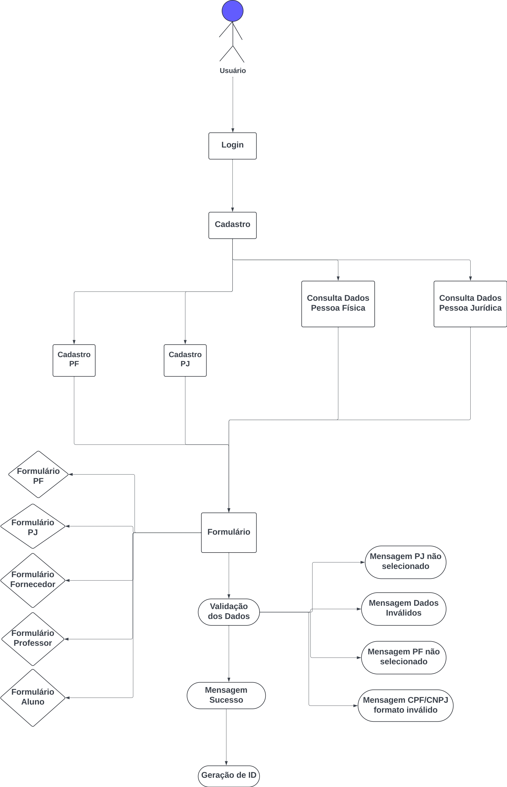
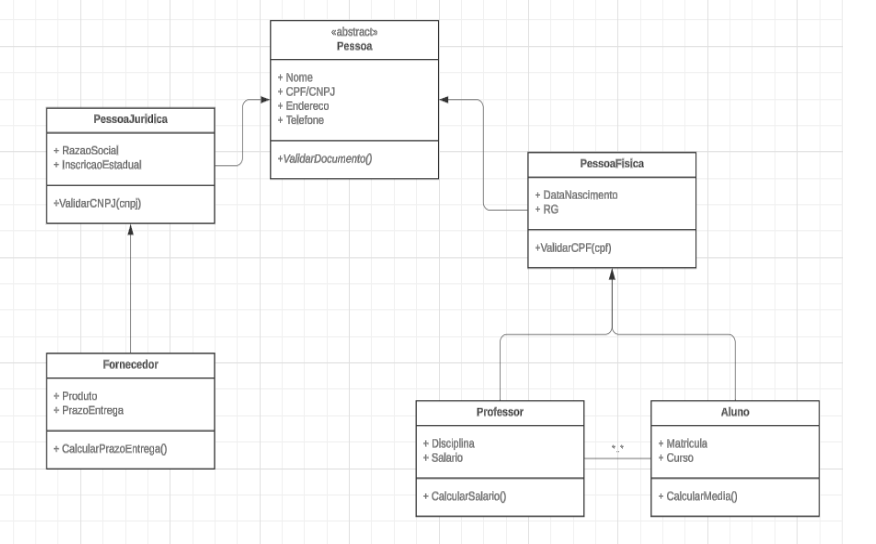

# Projeto Integrador - Grupo 02

## Integrantes do projeto

Este projeto foi desenvolvido pelos estudantes:

- Alice Abreu Rubim Dias

- Joaquim Amorim Nunes Junior

- Daniel Benelli Mouro

- Giovanna de Carvalho Saud

- Livian de Sousa Silva

- Thalles Diego Verneti Torma

- Patrick Matias da Silva
## Funcionalidades

- Tela de cadastro das entidades: Pessoa Física, Pessoa Jurídica, Aluno, Professor e Fornecedor.
- Tela de login (universal para as entidades).
- Página de Listagem de usuários.
- Página de edição de usuários.
- Dashboard (homepage).

## Documentação de cores

| Cor               | Hexadecimal                                                |
| ----------------- | ---------------------------------------------------------------- |
| Inputs            |  #198754 |
| Buttons           |  #031806 |
| Pop-up            |  #a3cfbb |

## Diagrama de Caso de Uso

## Diagrama de Classe UML

