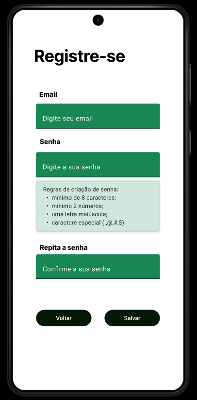
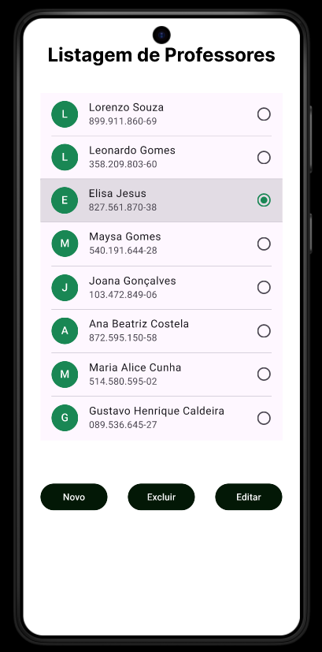

# Projeto Integrador - Grupo 02

 
## Integrantes do projeto

Este projeto foi desenvolvido pelos estudantes:

- Alice Abreu Rubim Dias

- Joaquim Amorim Nunes Junior

- Daniel Benelli Mouro

- Giovanna de Carvalho Saud

- Livian de Sousa Silva

- Thalles Diego Verneti Torma

- Patrick Matias da Silva
## Funcionalidades

- Tela de cadastro das entidades: Pessoa Física, Pessoa Jurídica, Aluno, Professor e Fornecedor.
- Tela de login (universal para as entidades).
- Página de Listagem de usuários.
- Página de edição de usuários.
- Dashboard (homepage).

## Documentação de cores

| Cor               | Hexadecimal                                                |
| ----------------- | ---------------------------------------------------------------- |
| Inputs            |  #198754 |
| Buttons           |  #031806 |
| Pop-up            |  #a3cfbb |

## Diagrama de Caso de Uso

## Diagrama de Classe UML

## Protótipo no Figma
Acesse este link para visualizar o protótipo completo no Figma: https://www.figma.com/proto/pp18hvB4DJ4rFKFUF8VNEZ/Interface-de-Usu%C3%A1rio?node-id=47-241&node-type=canvas&t=kmuOfnyWdih80YFD-1&scaling=scale-down&content-scaling=fixed&page-id=0%3A1

## Telas de Cadastro (Pessoa Física, Pessoa Jurídica, Usuários, Professor, Aluno e Fornecedor)
Estas são as telas de cadastro do nosso protótipo:

## Telas de Edição (Professor, Aluno, Fornecedor)

## Telas de Listagem (Professor, Aluno, Fornecedor)

## Dashboard

## Login

## Ferramentas

O esboço da prototipação foi realizado na ferramenta Excalidraw e foi de suma importância para o alinhamento do resultado final esperado na prototipação real.
Link do esboço: https://excalidraw.com/#json=UbNZ5XTU9xeTnK9u9TZ5e,FEhBdGWUzErhsHAoPzzK9w

A prototipação foi realizada através da ferramenta Figma, que possibilitou criar as diferentes telas do projeto.
Link da visualização dos protótipos já finalizados: https://www.figma.com/proto/pp18hvB4DJ4rFKFUF8VNEZ/Interface-de-Usu%C3%A1rio?node-id=116-3618&node-type=canvas&t=LJBmVQNkjK0bj0Nj-1&scaling=scale-down&content-scaling=fixed&page-id=0%3A1

Para tornar ainda mais fácil o processo de criação das telas em grupo, definimos a biblioteca Material 3 Design Kit como principal para criação dos componentes.

## Conclusão

Com a prototipação do projeto, foi possível aprender muito sobre UX/UI e compreender a real importância dessa etapa no processo de criação de um bom sistema ou website. Dessa forma, todos os participantes se sentem mais confiantes quando um novo desafio lhes é atribuído, seja na vida acadêmica ou profissional.
